A Python REPL demo with embedded Rust APIs using `pyo3`
## DEMO

## USAGE
see more in `cli/*`
## TODO
- [ ] pyi generate
- [x] continuation prompt
- [ ] corner case: ` ( ((()())))` `( ((()())))`
## Reference
[ptpython](https://github.com/prompt-toolkit/ptpython): A better Python REPL